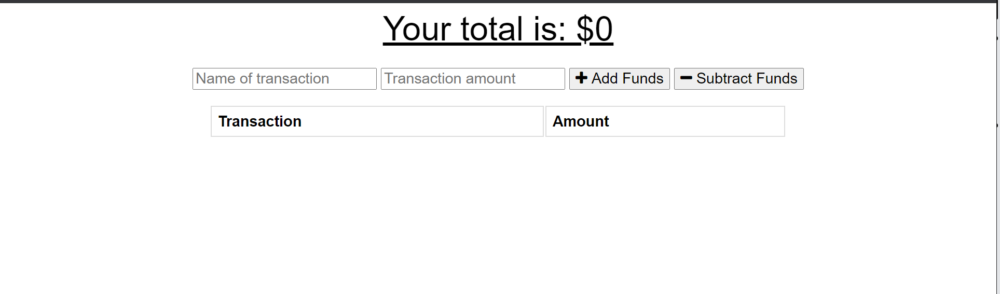
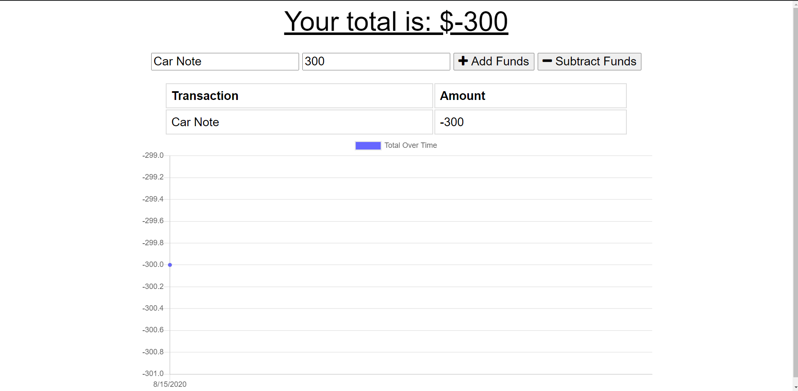
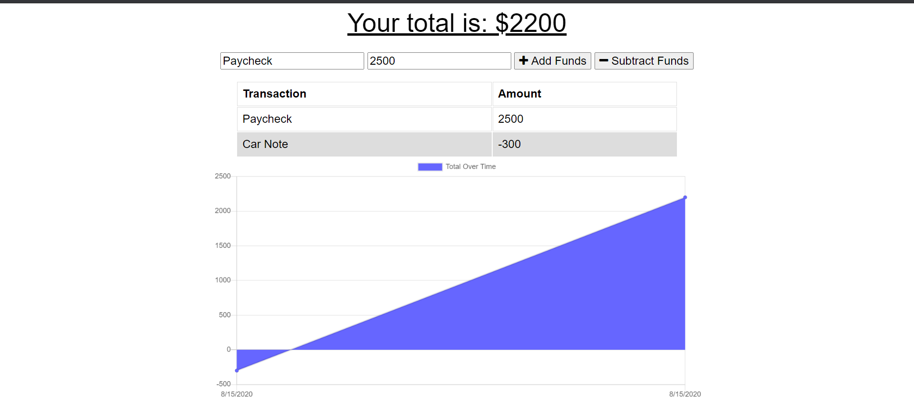

# Project Name 

  Budget Tracker

  ## Overview 
 Keeping track of your funds can help any person stay financially ahead through careful spending however it can be difficult to remember every purchase and every deposit. This budget tracker helps keep a log of your transactions while also updating the amount of funds you have afterwards. In case you need to log a transaction while no internet service is available the app works offline as well.

  ## Table of Contents:
  - [Links](#Links)
  - [Screenshots_and_GIFs](#Screenshots_and_GIFs)
  - [Usage](#Usage)
  - [Installation](#Installation)
  - [How_to_use](#How_to_use)
  - [License](#License)
  - [Contribute](#Contribute)

 ## Links
  - (https://camerong88.github.io/Budget_tracker/)
  - (https://github.com/CameronG88/Budget_tracker)
  - (https://budget-tracker-88.herokuapp.com/)

 ## Screenshots_and_GIFs 
  - 
  - 
  - 
  - 
  
  ## Usage
  The user is able to keep track of their expenses and deposits to help maintain a budget. This app continues to function with or without an internet connection and will automaticaly update your web information when a connection is found.

  ## Installation 
  No installation needed. Simply use the Heroku link above to be directed to the site and start tracking your budget today!

  ## How_to_use
  Once you have arrived at the home page enter the name of a transaction (ex. "Car Note"), then the amount of the transaction. Finally click to either subtract funds if this is a payment/withdrawal or to add funds if it is a deposit.

  ## License 
  MIT

  ## Credits
  John Dinsmore, Jorge Alvarez

  ## Contribute
  You can contribute by committing or commentting to the project in github using the link above.

  © Copyright 2020